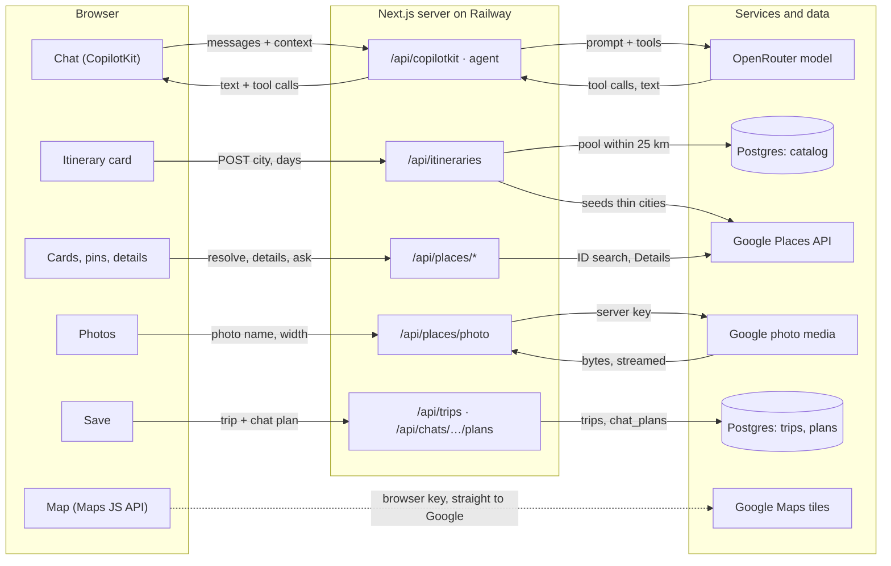
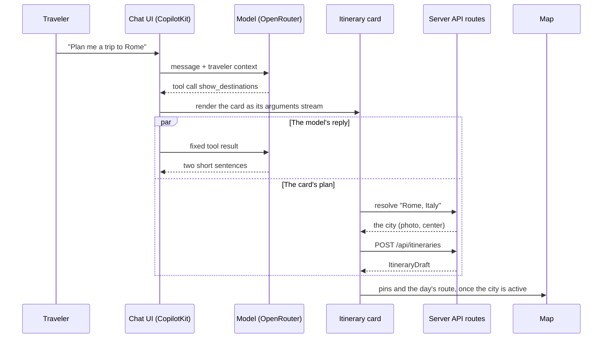
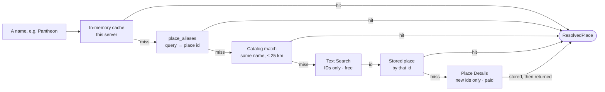
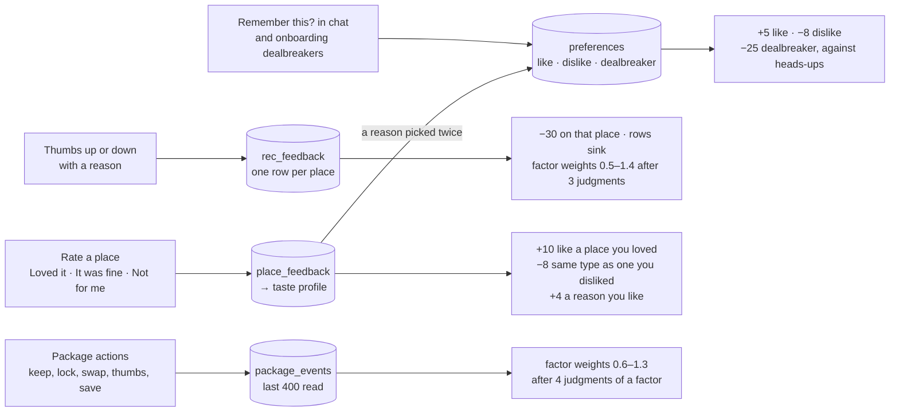
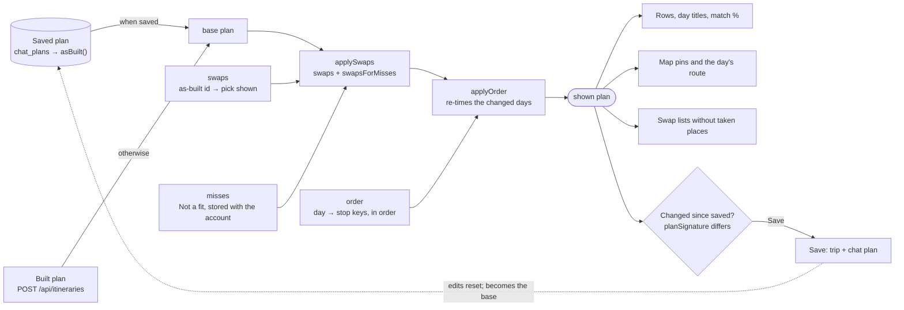
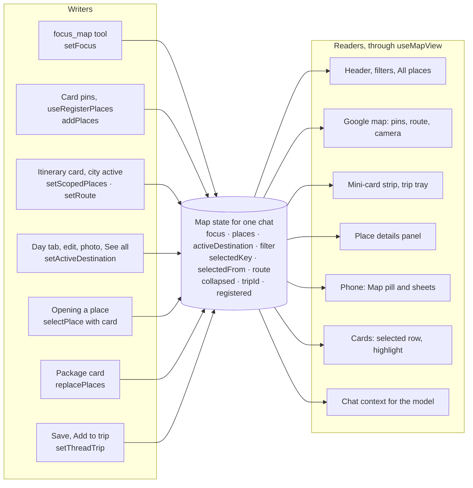

# XPMatch Rebuild Guide

How the concierge chat, the one-page itinerary, swapping and the map work, and what you would build
to recreate them. Every rule, number and label here was read from the code.

- **Source:** repository TayoAki/XPMatchv1, branch `main`, commit `5aadf35`
- **Written:** 28 September 2026
- **Live app:** app.xpmatchme.com

File references are relative to the repository root. `§N` points to a section of this guide.

## Contents

1. [The screen and the stack](#1-the-screen-and-the-stack)
2. [The traveler's journey](#2-the-travelers-journey)
3. [Architecture and data flow](#3-architecture-and-data-flow)
4. [The chat engine](#4-the-chat-engine)
5. [Places, photos and the catalog](#5-places-photos-and-the-catalog)
6. [The match score and learning](#6-the-match-score-and-learning)
7. [The itinerary builder](#7-the-itinerary-builder)
8. [The itinerary card](#8-the-itinerary-card)
9. [Editing: swaps and moves](#9-editing-swaps-and-moves)
10. [The map](#10-the-map)
11. [Saving and reopening](#11-saving-and-reopening)
12. [Place details, reviews and Ask](#12-place-details-reviews-and-ask)
13. [Trips after saving](#13-trips-after-saving)
14. [Discover, onboarding and the rest](#14-discover-onboarding-and-the-rest)
15. [Data model](#15-data-model)
16. [API reference](#16-api-reference)
17. [Rebuild order](#17-rebuild-order)
18. [Known limits](#18-known-limits)

---

## 1. The screen and the stack

XPMatch is a travel concierge. A traveler describes a trip in a chat. The assistant answers with a
card that holds a complete itinerary built for them, and a Google map beside the chat shows the day
they are looking at. They edit the plan on the card and tap Save to keep it with the chat and as a
trip.

```text
1280 px and wider (not to scale)
+--------------------------------------------------------------------------------+
| xpmatch.    Discover · My trips · Saved      bell · avatar · Create a trip     |
+-------------+-----------------------------------+------------------------------+
| Side rail   | Exploring Rome                    | Explore Rome                 |
| 236 px      | Your personal travel concierge    | Day 2 of your itinerary      |
|             |                                   | All Stays Dining Experiences |
| + New chat  | +-------------------------------+ | +-------------------------+  |
| Chats       | | Itinerary card                | | | map: the stay and the   |  |
|  Exploring  | | photo · title · match         | | | day's numbered stops,   |  |
|   Rome      | | Click to edit · Save          | | | joined by the route     |  |
|  (3 days in | | Where you'll stay             | | +-------------------------+  |
|   Rome)     | | Day 1 · Day 2 · Day 3         | | mini cards, one per pin      |
| Trips       | | the day's stops, in order     | | Your trip · View trip        |
| Saved       | +-------------------------------+ |                              |
| Updates     | two short sentences from the      | weather · satellite · search |
| Inspiration | assistant                         |                              |
| Create      | [ Ask your concierge          ]   | clamp(360px, 30vw, 520px)    |
|             | Where · When · Who · Budget       |                              |
| Collapse    | chat column, up to 54rem          |                              |
+-------------+-----------------------------------+------------------------------+

Phone, under 768 px
+-----------------------------+
| Exploring Rome   [Map · 5]  |
| +-------------------------+ |
| | Itinerary card          | |
| | full width, same parts  | |
| | Details open a sheet    | |
| +-------------------------+ |
| [ Ask your concierge     ]  |
|                             |
| ~ map sheet, place sheet ~  |
| ~ rise over the chat     ~  |
+-----------------------------+
| Discover  Trips  Saved      |
| Concierge  More             |
+-----------------------------+
```

The map column appears at 1280 px; below that the map is a sheet opened from the "Map · N pinned"
pill. The side rail appears at 768 px on every page except Discover; below 768 px a tab bar replaces
it.

- **Under 640 px:** phone behavior. Onboarding runs one column wide (no photo), chip groups in Update
  my assistant fold, pickers open as sheets.
- **Under 768 px:** the bottom tab bar (Discover, Trips, Saved, Concierge, More). No side rail,
  header links or account menu.
- **768 px and up:** the side rail, 236 px (68 px collapsed).
- **1024 px and up:** the full header, with the first name beside the avatar.
- **1280 px and up:** the map column beside the chat.

### The stack

| Layer | Choice | Notes |
| --- | --- | --- |
| App | Next.js 16.3.5 (App Router), React 19.2.8 | This Next.js version changed APIs and conventions (for example `src/proxy.ts` gates routes). Read the docs it ships in `node_modules/next/dist/docs/` before copying older patterns. |
| Styling | Tailwind CSS 4 | Tokens in `src/app/globals.css`: brand `#064650`, Inter for the interface, Source Serif 4 for titles. |
| Chat | CopilotKit v2 (1.72) | A runtime on the server; the chat UI and tool-call rendering in the browser. |
| Model | OpenRouter through the AI SDK (`@ai-sdk/openai-compatible`) | Default `openai/gpt-4o-mini`. |
| Places | Google Places API (New) | Server only, behind our own catalog (§5). |
| Map | Google Maps JavaScript API | Advanced markers holding our own HTML pins (§10). |
| Travel times | Google Routes API | The trip board only (§13). |
| Data | Postgres on Railway; PGlite on a laptop | Migrations in `src/server/schema.ts`, run on first use. |
| Drag and drop | dnd-kit | Plan rows and the trip board. |
| Tests | Playwright, Vitest | End-to-end runs use stand-in servers for the model, Places and email (`tests/e2e`). |
| Hosting | Docker (standalone output) on Railway | Health check `/api/health`. |

---

## 2. The traveler's journey

This is the whole experience in the order a new traveler meets it. Each step names the section that
explains how it works.

1. **Sign up.** Name, email and a password of at least 8 characters. The server sets a 30-day
   session cookie and creates an empty profile (§14).
2. **Tell the assistant about yourself.** On screens 640 px and wider a six-step dialog opens, "Let's
   personalize your assistant": about you, style and interests, where you stay, how you eat,
   logistics and next trip, dealbreakers and notes. On phones a three-question quiz runs as chat
   bubbles instead. Everything is optional and editable later under "Update my assistant" (§14).
3. **Land on Discover.** A hero photo of a place that matters to you (your next trip, your dream
   destination, or your home city), a composer ("Describe your ideal escape…"), Where, When, Guests
   and Budget fields, three collections, "For you in {city}" picks (things to do, stays, restaurants,
   each scored for you), Jump back in, and the newest community guides (§14).
4. **Ask.** From Discover's composer, a chip, or the chat. A new chat starts with blank chips unless
   values were just set on Discover (§4).
5. **Get a plan, not a list.** The assistant centers the map on the place and answers with
   destination cards. A city gets its itinerary card; a country or region gets 3–4 city cards above
   the itinerary of the one picked. The assistant adds at most two short sentences: what it assumed
   and the next step (§4, §7, §8).
6. **Look through it.** Day tabs switch days, and the map beside the chat shows that day's stops
   numbered, with the route. "Details & reviews" opens a place on the map with photos, hours, links,
   Google's and travelers' reviews, and Ask about this place (§10, §12).
7. **Make it yours.** Click to edit. Swap any place for a ready alternative or anything from the
   city's lists, mark places Not a fit, and move stops by dragging, arrows or a day picker (§9).
8. **Save.** One tap keeps the plan with the chat and creates the trip. The chat is labeled with the
   trip in the side rail, the map shows "Your trip", and reopening the chat shows the saved plan
   (§11).
9. **Plan the rest on the trip page.** A board of days with drag and drop, travel times by walking,
   driving or transit, ideas, bookings, media, members with edit or view rights, and a chat tied to
   the trip (§13).
10. **Go, and tell us how it was.** Check in at a place to prove a visit and review it. After the
    trip, a "How was Rome?" banner asks for ratings. Every thumb, rating and remembered preference
    changes future scores (§6, §12).
11. **Come back.** Saved (places, guides, imports), Updates (trip invites and activity), Inspiration
    (community guides and curated collections), Create (write a guide), and Import inspiration from a
    link or a screenshot (§14).

---

## 3. Architecture and data flow

XPMatch is one Next.js app. The browser renders the chat, the cards and the map. The server runs the
chat agent, builds itineraries, looks up places and stores everything in Postgres. A few outside
services supply the rest.



*Solid arrows go through our server; the dashed one goes from the browser straight to Google. Two
more requests skip the server and are not drawn: Wikipedia images for places without a photo, and
the Wikipedia summary shown for a city.*

| Service | Called from | Used for | Settings (names only) |
| --- | --- | --- | --- |
| OpenRouter | Server | The chat model; a helper model for Ask and imports; a vision model for screenshots | `OPENROUTER_API_KEY`, `OPENROUTER_MODEL`, `HELPER_MODEL`, `HELPER_VISION_MODEL` |
| Google Places API (New) | Server | Resolving names, lists, details, photos | `GOOGLE_MAPS_API_KEY` |
| Google Maps JavaScript API | Browser | The map and its markers | `NEXT_PUBLIC_GOOGLE_MAPS_API_KEY`, `NEXT_PUBLIC_GOOGLE_MAPS_MAP_ID` |
| Google Routes API | Server | Walk, drive and transit times on the trip board | the server key, `ROUTES_API_ENABLED` |
| Open-Meteo | Server | The weather chip, the weather tool, a geocoding fallback | none |
| Wikipedia | Browser and server | Fallback images, city summaries, the destination facts tool | none |
| Resend | Server | Password reset email | `RESEND_API_KEY`, `EMAIL_FROM` |

API routes check the session themselves (`requireUser` in `src/server/http.ts`), except the public
sign-in and health routes and the weather route. Writes must also come from the same origin, by
`Sec-Fetch-Site` or a matching Origin, or they get 403. `src/proxy.ts` only checks that a session
cookie exists, sending pages to `/login?next=…` and API calls to 401.

---

## 4. The chat engine

The chat is CopilotKit v2. Its runtime lives at `src/app/api/copilotkit/[[...path]]/route.ts`, needs a
session, and serves one agent (`src/server/agent.ts`, up to 6 steps per run). CopilotKit's own thread,
memory and debug endpoints are refused. The browser side is `src/components/chat/TravelChat.tsx` and
`TravelCopilot.tsx`, where every tool the model can call is registered with the React component that
renders it.

### The model

`src/server/model.ts` picks, in order: `COPILOT_MODEL` if set; OpenRouter when `OPENROUTER_API_KEY` is
set, with `OPENROUTER_MODEL` or `openai/gpt-4o-mini`; then direct Anthropic, OpenAI or Google keys;
and with no key at all, a canned demo model. Ask and imports use `HELPER_MODEL` (else the same
model), screenshots `HELPER_VISION_MODEL` (default `openai/gpt-4o-mini`).

### What the model is told

A fixed system prompt (`src/lib/travel/prompt.ts`) plus the traveler's context, which the browser
sends with every run and CopilotKit appends to the prompt.

- **Context:** the profile; learned likes, dislikes and dealbreakers; the taste summary; a thumbs
  summary (how many judged, the hit rate, the 10 most recent misses, the top three reasons); planner
  values; saved items and trips; the map's focus and its first 25 pins; search chips; today's date;
  and a pool of stored places for the city in focus (name, kind, category, price, rating). A chat tied
  to a trip adds the trip, its ideas, bookings, itinerary and trip preferences.
- **Personalize everything** and say briefly why it fits. The latest message beats the planner, the
  map and existing trips.
- **Cards before questions.** Fill gaps from the planner, then the profile, then defaults (flexible
  dates in the best season, a long weekend for a short trip, about a week for a long-haul country),
  and state those assumptions in one short sentence after the cards. Ask where only when there is no
  destination at all, and even then show 3–4 destination cards.
- **Every trip request gets `show_destinations`.** A country or region: `focus_map`, then 3–4 cities.
  A named city: `focus_map`, then that one card. Never open a city with a package or `create_trip`,
  never write the days out in text, and close by inviting "Click to edit" or "Save".
- **Other rules:** packages only when asked for; 0–3 honest heads-ups per place, never invented; never
  state a match score; never recommend a place the traveler passed on; `set_search_constraints`
  before a filtered search; `remember_preference` only when learning from chats is on and never for
  sensitive facts; prices are estimates; warm, concise, no tables.

### One trip request, end to end



*The model finishes its two sentences while the card fetches the plan. The model never sees the plan.
The card asks for it only once it is on screen, and pins it only after the traveler interacts with
the card (§10).*

### The tools

| Tool | What it does | What shows in the chat |
| --- | --- | --- |
| `focus_map` | Resolves a place, centers the map on it, renames the chat "Exploring {name}" and saves the destination | "Looks like you're headed to Rome." with Create trip |
| `show_destinations` | One or more cities with the model's tagline, reasons and suggested stay | The city row and itinerary cards (§8) |
| `show_package` | Asks `/api/packages` for a stay, things to do and places to eat, in three variants | Package card with swap, lock, thumbs, narrowing chips, Make itinerary |
| `show_hotels`, `show_restaurants`, `show_attractions` | Cards from the model's own fields; each place is pinned through the resolve route and scored in the browser | A row of cards with match, thumbs, heads-ups, Compare, Add to trip |
| `show_flights` | The model's estimates; nothing is looked up | Flight cards with "Search on Google Flights" |
| `compare_options` | A side-by-side table written by the model | Priority rows, strengths, compromises, "Pick this one" |
| `ask_about_place` | Calls `/api/places/ask` (§12) | "About {name}" with the answer and quotes |
| `create_trip` | Waits for the traveler to confirm a written plan | Trip proposal: Save to my trips / Not yet |
| `remember_preference` | Waits for a click before storing a preference | "Remember this?" Always / For this trip / No thanks |
| `set_search_constraints` | Turns criteria into chips (dark = must-have, light = preference) | "Understood as" chips |
| `record_feedback`, `update_traveler_profile` | Store a judgment or profile fields | "Noted: …", "Preferences remembered" |
| `import_inspiration` | Reads a pasted link (§14) | "Imported from {site}" cards |
| `update_trip_plan`, `add_trip_ideas`, `schedule_stops` | Trip chats only: rewrite the days, add ideas, place stops on days | Status chips with Open the board |
| `get_weather_outlook`, `get_destination_facts` | Server tools: Open-Meteo (up to 16 days) and a Wikipedia summary | Nothing; the model uses the answer |

Every card tool returns the same fixed text to the model:

> The cards are now on screen with every name, photo and detail. Do not list, number or summarize
> them again. Reply with at most two short sentences: any assumptions you made (length, travelers,
> dates) and the next step.

The model never receives the places, scores or plan it caused to appear, so it cannot contradict or
restate them.

### Chats, titles and transcripts

- `/chat?thread={id}` reopens a chat, `?prompt=` sends a message once the chat is ready, `?trip=` ties
  the chat to a trip.
- The first message, cut to 70 characters, names the chat (`PUT /api/chats/{id}`); `focus_map` renames
  it "Exploring {place}" and saves the place, which brings the map back on reopen.
- Transcripts are saved to `chat_messages` when a run finishes, trimmed to 400 messages or 1.5 MB at a
  user turn. Reopening replays a live run or loads the stored transcript; unanswered tool calls get a
  neutral result so the next run is valid.
- New chat stops the running answer first (up to 1.5 s), resets the chips and starts a fresh thread
  id.
- Before the first message the chat shows fixed suggestion chips; after it, two or three written by
  the model, paused while a confirmation card is waiting.

> **Rebuild note.** Render cards from tool calls, and keep the model's side of each card to naming
> things. The server fills in the places, the photos and the scores, and the fixed tool result keeps
> the reply short.

---

## 5. Places, photos and the catalog

Every place in the app, from a city on a card to a restaurant in a swap list, is a Google place that
went through our own server. The server keeps a catalog of every place it has looked up, so a place
is paid for once and then served from Postgres. The code is in `src/server/places.ts` and
`src/server/catalog.ts`.

### Turning a name into a place

Cards and the builder ask for places by name ("Pantheon", "Rome, Italy"). One pipeline answers all of
them, and it stops at the first step that knows the answer.



*The fourth step returns only an id, so it always continues to the fifth. Only a place the catalog has
never seen costs a paid Details call, which then stores it. Every answer is remembered in the cache
and the aliases.*

- The ID-only Text Search asks Google for one result, field mask `places.id`, biased to 40 km around
  the city.
- A stored place older than 30 days is fetched again when a lookup serves it. Places read in bulk
  (the builder's pools) are never refreshed.
- Without a Google key, cities come from Open-Meteo's geocoder and other places become estimated pins
  (`est:` ids) scattered around the city center. List searches then return nothing, so itinerary
  cards show their empty state.

### What a place holds

```ts
// src/lib/places/types.ts
interface ResolvedPlace {
  id: string;                 // Google place id, or "est:…" for an estimated location
  name: string;
  kind: "destination" | "hotel" | "restaurant" | "attraction";
  lat: number; lng: number;
  address?: string;
  locality?: string;          // "Rome, Lazio"
  category?: string;          // Google's primary type, "Art museum"
  rating?: number; userRatingCount?: number;
  priceLevel?: string;        // "$" … "$$$$"
  summary?: string;
  photos: string[];           // "/api/places/photo?name=places/…/photos/…&w=800", up to 6
  photoCredits?: { name: string; uri?: string }[];   // aligned with photos
  googleMapsUri?: string; websiteUri?: string;
  viewport?: { north: number; south: number; east: number; west: number };
  types?: string[];
  source: "google" | "estimate";
}
```

Two field masks decide what Google returns. The card mask, used for lists and lookups, asks for id,
displayName, formattedAddress, addressComponents, location, viewport, rating, userRatingCount,
primaryTypeDisplayName, photos.name, photos.authorAttributions, googleMapsUri, websiteUri, priceLevel
and types. The details mask adds editorialSummary, weekday opening hours, internationalPhoneNumber,
reviews, reviewSummary, generativeSummary and about twenty attributes (dogs, children, vegetarian
food, reservations, accessibility, parking, payment). Details are fetched only when someone opens a
place (§12).

### Lists and what is kept

Lists of places come from `places:searchText` (up to 20 results, biased to 25 km, with price, rating
and open-now filters) and `places:searchNearby` (by type, ranked by popularity, 25 km). Every place a
list returns lands in the catalog.

| Table | Holds | Lifetime |
| --- | --- | --- |
| `places` | Every Google place as returned, with the card fields | Refreshed after 30 days, only when a lookup serves it |
| `place_aliases` | Query text → place id | Kept |
| `search_cache` | The ordered ids a list search returned | 24 hours |
| `photo_urls` | Google's resolved image address for a photo name | 24 hours (plus 2 hours in memory) |
| `place_facts` | Full details: up to 10 photos, 5 reviews, hours, phone, summaries, attributes | 30 days |

Each traveler may make 400 lookups in a rolling 24 hours (`src/server/lookup-budget.ts`). The resolve
route, the itinerary route (one lookup per plan), packages and trip edits charge it. Past the limit
the API answers "Daily place lookup limit reached. It resets tomorrow."

### Photos

1. A place carries photo references such as `places/ChIJ…/photos/Aap…`, never image files.
   `toResolved` turns each into our own address, `/api/places/photo?name=…&w=800`.
2. The browser loads that address. The route (`src/app/api/places/photo/route.ts`) needs a signed-in
   session and checks the reference's format.
3. The server asks Google's photo media endpoint for the image address,
   `{name}/media?maxWidthPx=…&skipHttpRedirect=true` with the server key, and clamps the width to
   100–1600 px. It remembers the address for 24 hours.
4. It fetches the image and streams the bytes back. If the remembered address fails, it asks Google
   once more for a fresh one. The response is cacheable for a day
   (`public, max-age=86400, stale-while-revalidate=604800`).
5. Every photo shows its credit: "Photo: {author}", linked to the author's Google profile, taken from
   the first author attribution with a name (else "Google user"). Small thumbnails carry it as a
   tooltip.

City photos on the cards come the same way: the city is a Google place and its first photo is the
hero. When a place has no photo, `PlaceImage` asks Wikipedia from the browser (the `pageimages` API at
800 px, then the page summary's thumbnail) and paints one of six gradients underneath, picked by a
hash of the name. Get inspired, Inspiration rows and the trip proposal header use Wikipedia as their
main image.

People add images in two places. An import screenshot goes to a vision model to read the places in it
and is not kept. A bug report screenshot is shrunk to 1280 px in the browser and stored for admins.

> **Rebuild note.** Keep the Places key on the server and serve photos through your own route. The
> browser only ever gets the Maps JavaScript key, which you restrict to your domain.

---

## 6. The match score and learning

Every recommendation carries a score from 5 to 99 and the reasons behind it. One function computes it
everywhere, `scoreMatch` in `src/lib/match.ts`. It runs on the server for the builder, packages and
home picks, and in the browser (`useMatch`) for badges, so a thumb moves a badge at once.

### Inputs

- **The traveler:** `{ profile, taste, preferences, recFeedback, packageCalibration }`.
- **The candidate:** `{ kind, name, category, priceLevel, rating, userRatingCount, text, tradeoffs }`.
  Keyword checks run on the category, text and name, lowercased, keeping letters, digits, `$` and
  spaces.

### The formula

Score = 55 + the sum of the points below, rounded and kept within 5–99. Positive points are multiplied
by two learned weights, one from thumbs and one from package choices. Negative points are never
weighted.

| Factor | Rule | Points | Reason text |
| --- | --- | --- | --- |
| Quality | Rating ≥ 4.6 with ≥ 200 ratings, or else ≥ 4.3 | +12 / +7 | "Rated 4.7 by 1.2K people" |
| | Rating below 4.0 | −8 | |
| | 1 to 49 ratings | −3 | "Few reviews yet" |
| Price vs budget | Levels: budget 1, mid-range 2, premium 3, luxury 4. Same level | +10 | "`$$` fits your mid-range budget" |
| | One below / one above | +4 / 0 | "a notch below your usual" / "a notch above your usual" |
| | Two or more above / below | −10 / −4 | "pricier than your usual" / "cheaper than your usual" |
| | A free attraction | +3 | "Free to visit" |
| Sights and cities | First matching interest, second one; if none match, travel styles (up to 2) | +12, +6; +6 each | |
| Hotels | Stay type; must-haves (up to 3); the accommodation note; if no stay type matched, a Luxury, Budget travel or Wellness style | +10; +4 each; +4; +6 | 'Matches "…"' |
| Restaurants | Cuisine; a dietary tag (or the free-text diet note); an adventurous eater and street food, markets, stalls or locals; no cuisine match but a "Food & drink" style | +12; +6 (+5); +4; +4 | "X options mentioned", "The kind of local spot you go for" |
| Companions | Family and kid words / partner and romantic words | +6 / +4 | "Good for the kids" / "Made for two" |
| Taste | A loved place of the same category; else a disliked one; else a liked reason word | +10 / −8 / +4 | "Like X, which you loved", "Same type as X, not for you", "Matches what you like: …" |
| Preferences | A statement matches when half its content words appear. Like / dislike / dealbreaker (checked against heads-ups only) | +5 / −8 / −25 | "Conflicts with a dealbreaker: …" |
| Heads-ups | Each tradeoff on the card, up to 3 | −4 each | "2 heads-ups" |
| Passed before | A thumbs-down on the same kind and name | −30 | "You passed on this before" |

Labels: 80 and up "Great match", 65 "Good match", 50 "Worth a look", below 50 "Probably not you". The
badge reads "Good match · 76%" and opens "Why this score" with up to eight reasons and their points.
The one-line reason on rows (`whyFor` in `src/lib/recs/why.ts`) joins the two strongest positive
reasons other than the rating, then falls back to the rating reason, then "category · price", then "A
solid pick here".

### How it learns



*Thumbs and ratings are separate signals. Thumbs say "right for me or not" about a recommendation; a
rating says how a visit went. Each is kept in its own table and changes the score in its own way.*

- **Thumbs** (`RecThumbs`) are keyed by the Google place id, or `name:{slug}`. Up records at once.
  Down opens "What is off?" with Too pricey, Wrong vibe, Too far, Already been, Not my thing and
  Other. A chip records the miss with that reason; closing the panel records it without one. The same
  thumb again takes it back. `POST /api/me/recs` stores the verdict, the score the traveler saw, the
  factors that fired and the reason. A factor's thumbs weight is 0.5 + ups ÷ judgments, once it has 3.
  Reasons do not change points.
- **Row order:** in every row of cards, thumbed-up first, undecided next, thumbed-down last and
  greyed out (`src/lib/recs/verdict.ts`). Cards glide to their new places unless the traveler prefers
  reduced motion.
- **Ratings** (`ReactionControl`, "Rate") ask "How was {name}?", then reason chips ("What stood out?"
  or "What went wrong?") and an optional note. `POST /api/me/feedback` stores the reaction and
  rebuilds the taste profile in `profiles.taste`. The profile is kept per domain (stays, food,
  activities, destinations): reaction counts, liked and disliked reasons, a ranked list of places,
  the categories of loved places, and the price level most loved places share.
- **Preferences** are statements such as "Avoids noisy stays" with a domain (stays, food, flights,
  activities, general) and a polarity (like, dislike, dealbreaker). They come from onboarding, from
  the chat's "Remember this?" card (Always, For this trip, No thanks), and from any reason chip picked
  twice. Trip-only preferences reach the chat but not the score.
- **Package calibration** reads the last 400 package events. A factor judged 4 or more times gets a
  weight of 0.5 + kept ÷ judged, kept within 0.6–1.3.
- **The chat model** sees a summary: how many picks were judged, the hit rate, the 10 most recent
  misses and the top three miss reasons.

---

## 7. The itinerary builder

Each destination card asks the server for a complete plan: `POST /api/itineraries` with
`{ "destination": "Rome, Italy", "days": 3 }`. The server builds it from places it already knows,
tops up a thin city from Google, and returns an `ItineraryDraft`. Nothing is saved yet. The route
loads the traveler's profile, taste summary, learned preferences, past thumbs and learned weights,
and charges one lookup.

Code: `src/app/api/itineraries/route.ts`, `src/server/itineraries.ts`, `src/server/packages.ts`.

### The steps

1. **Place the city.** `resolveDestination` returns the city as a place with its center, viewport and
   photo. An unknown city answers 404, "Couldn't place … on the map".
2. **Load the pools.** For hotels, things to do and restaurants, read the stored places within 25 km
   of the center, up to 400 of each. If a kind has fewer than 12 and a Google key is set, seed it: run
   the traveler's own searches for that kind (the ones Discover uses, built from their stay types,
   interests and cuisines) plus three generic ones, each as "{query} in Rome" with up to 20 results,
   then read the pool again.
3. **Score and filter.** Leave out any place the request excludes. Score every place for this
   traveler (§6). Drop places they thumbed down before, places that hit a dealbreaker and types they
   dislike. Apply a quality floor: rated 4.0 or more with at least 50 reviews (adventurous eaters skip
   the review count for restaurants, and unrated places pass). If fewer than 6 survive the floor, drop
   the floor. Sort by score, then by number of reviews.
4. **Pick the stay.** The hotel with the best `score + timeFit − 2 × (km from the center beyond 3)`.
   The stay, or the city center when there is no hotel, anchors every day.
5. **Pick the things to do.** Reach is the walking tolerance times 2.5: 7.5 km for "lots", 5 km for
   "moderate", 2.5 km for "little". Each place is worth
   `score + timeFit − min(25, 2 × km beyond reach from the stay)`. Take days × things per day
   (relaxed 2, balanced 3, packed 4), keeping variety: one branch per place name, and no more than a
   third (at least 2) from one category while other kinds are left.
6. **Split them into days by area.** The best place seeds day one. Each next seed is the place
   farthest from the seeds so far. Every other place joins the nearest seed that still has room. Days
   are ordered by their best place.
7. **Order each day.** Nearest place next, starting from the stay. The first half (rounded up) is the
   morning, the rest the afternoon.
8. **Set the times.** See the chart below.
9. **Pick the meals.** For each meal, the restaurant with the best
   `score + 8 if it serves the local food − 3 × km beyond 1 from the stop before − 8 if it would be a second $$$$ meal that day`.
   The local food comes from the country at the end of the city's address ("Italy" gives "italian";
   about 40 countries are mapped). No restaurant, or branch of one, is used twice. Every day gets
   dinner while restaurants last. Lunch goes only to the first (restaurants − days) days.
10. **Name the days** after their first two things to do, "Pantheon · Trastevere", or "Eat your way
    around" for a day with no sights.
11. **Add ready alternates.** Every pick gets three (§9): the best places of its kind that are not in
    the plan, with no second branch of a place in the plan. For a stop they are valued
    `score − 3 × km beyond 1 from that stop`, plus timeFit for sights or the local-food bonus for
    restaurants. The stay's alternates use the stay rule. Alternates keep one photo each so the draft
    stays small.
12. **Score the plan** as the average of the stay and every stop, rounded and kept within 5–99.

```mermaid
gantt
    title One balanced day with three things to do
    dateFormat HH:mm
    axisFormat %H:%M
    section Morning
    Museum, 120 min      :museum, 09:30, 120m
    Viewpoint, 60 min    :view, 11:50, 60m
    section Lunch
    Lunch, 75 min        :lunch, 13:10, 75m
    section Afternoon
    Park, 90 min         :park, 14:45, 90m
    section Dinner
    Dinner, 75 min       :dinner, 19:00, 75m
```



*The day starts at 09:30 (08:30 for early risers, 10:30 for late ones). A visit lasts 120 minutes for
museums, galleries, palaces, castles, zoos, aquariums and theme parks; 60 for viewpoints, towers,
churches, temples, shrines, cathedrals, monuments, squares, fountains and bridges; 90 for anything
else. Twenty minutes separate stops. Lunch waits for the morning but never starts before 12:30.
Dinner starts at 19:00 (18:30 early, 20:00 late) or later if the afternoon runs long. Meals last 75
minutes.*

### Constants

| Rule | Value | Where |
| --- | --- | --- |
| Pool radius | 25 km, up to 400 places per kind | `catalog.ts:19` |
| Seed a kind when | fewer than 12 stored | `packages.ts:78` |
| Quality floor | ★ 4.0 and 50+ reviews; dropped if fewer than 6 pass | `packages.ts:162-175` |
| Days | 1 to 7, default 3 | `lib/itinerary.ts:205` |
| Things per day | relaxed 2 · balanced 3 · packed 4 | `packages.ts:101` |
| Walking reach | 3, 2 or 1 km × 2.5 | `itineraries.ts:216` |
| Day start | 08:30 · 09:30 · 10:30 | `itineraries.ts:57` |
| Dinner from | 18:30 · 19:00 · 20:00 | `itineraries.ts:58` |
| Lunch from | 12:30, 75 minutes | `itineraries.ts:59-60` |
| Between stops | 20 minutes | `itineraries.ts:61` |
| Local food bonus | +8 | `itineraries.ts:86` |
| Ready alternates | 3 per pick | `itineraries.ts:63` |
| timeFit | +3 for morning places (café, bakery, market, park, garden, museum…) when the day rhythm is early, or evening places (bar, wine, jazz, club…) when it is late | `packages.ts:186-191` |

### What comes back

```ts
// src/server/itineraries.ts
interface DraftPick {
  place: ResolvedPlace;
  match: MatchResult;          // score 5–99, label, reasons (§6)
  why: string;                 // one line from the reasons
  alternates?: DraftPick[];    // 3 ready swaps, one photo each
  swappedFrom?: string;        // set in the browser only: the as-built id this pick replaced
}
interface DraftStop extends DraftPick {
  kind: "attraction" | "restaurant";
  meal?: "lunch" | "dinner";
  startTime: string;           // "09:30"
  durationMin: number;
}
interface ItineraryDraft {
  destination: ResolvedPlace;
  stay: DraftPick | null;
  days: { day: number; title: string; stops: DraftStop[] }[];
  score: number;               // average match of the stay and every stop
  basedOn: string[];           // "Boutique hotel", "Museums & art", "premium budget"
  provider: "google" | "fallback";
  generatedAt: string;
}
```

In the browser, `loadItineraryDraft` (`src/lib/recs/itinerary-draft.ts`) caches each request by
destination, days and filters for the session, so two cards for the same city share one plan. The day
count comes from the chat's dates when they are set, otherwise from the model's suggested stay ("3–4
nights"), with 3 as the default and 7 as the cap.

---

## 8. The itinerary card

The model shows destinations by calling `show_destinations` with one or more cities (§4). Each city
arrives with text the model wrote: name, country, a tagline under 72 characters, why it fits, what it
is known for, vibes, highlights and a suggested stay. The card turns that into the plan and keeps it
in the chat. Code: `src/components/chat/cards/DestinationCards.tsx` and `ItineraryDays.tsx`.

### One city or several

- **One city** shows its itinerary card alone.
- **Several cities** show a header with the title and "Pick one to see its itinerary", then a row of
  small city cards 210 px wide: photo, name, country, tagline, match and thumbs. Thumbs order the row:
  a city thumbed down moves to the end, greyed out. Picking a card shows its itinerary below the row
  and makes that city the one on the map.
- Every city's itinerary card is mounted, but only the picked one is visible. A hidden card never
  comes on screen, so its plan is built the first time it is picked.
- A city's own match is scored in the browser from the model's text for it (tagline, why it fits,
  vibes, highlights) and the city's Google rating.
- A city the traveler rated "Not for me" folds away into a one-line card.

### From top to bottom

- **Photo.** 136 px tall (148 px from the small breakpoint). The city's first Google photo with its
  credit at the bottom right, the city name in the display serif, the country with a pin icon, and
  thumbs at the top right. Tapping the photo makes this city the one on the map.
- **Title and match.** "Your Rome itinerary" and the plan's match badge in its large size. The badge
  shows the plan score with its label. Its reasons are the ones a good share of the plan's places
  have in common, such as "Matches Museums & art (4 places)" (`draftMatch`).
- **Meta line.** "3 days · Oct 12–15 · 2 travelers": days from the plan, dates and travelers from the
  chat's chips. Once saved it adds "In your trips", a link to the trip.
- **Buttons.** Click to edit (Done editing while on) and Save (§11). Both are hidden when no plan could
  be built.
- **Where you'll stay.** The hotel's photo, short name and type: the first of the traveler's stay
  types it matches ("Boutique hotel"), else Google's category, else "Hotel".
- **Day tabs.** "Day 1" to "Day N" as a tablist. The left and right arrow keys move between days, and
  only the selected tab is in the tab order.
- **The day.** A header "Day 2 · Pantheon · Trastevere" with "3 stops", then the stops in order. Each
  row has its number, a photo, the start time, the short name, a "Swapped in" tag when it replaced
  another place, a line saying what it is ("Park · Nature & hiking", "Dinner · Italian"), and "Details
  & reviews". The whole row opens the place (§10, §12).

### States

| State | When | What shows |
| --- | --- | --- |
| Skeleton | The tool call is still streaming and no city has arrived | Grey blocks, labeled "Building your itinerary" for screen readers |
| Building | The city is known and the plan is on its way | A grey stay box, three tab pills and a day block |
| Ready | The plan has days | The full card |
| Empty | The builder found no days | Why it fits, "Three to explore" with Find options for each highlight, and "Not enough places here yet to plan the days." with Ask the concierge |
| Failed | The request failed | "Couldn't build the itinerary." with Retry |
| Saved | This card has a saved plan | The saved plan, and Save reads "Saved" |

A card asks for its plan only when it has come on screen (an IntersectionObserver), its city is
placed, the chat's saved plans are known, and none is saved for it. Place names are shortened for
display (`shortPlaceName`): "Josun Palace, a Luxury Collection Hotel, Seoul Gangnam" reads "Josun
Palace".

> **Rebuild note.** Give the card everything it shows. The model's job ends at naming the cities and
> writing the tagline; the plan, the places, the photos and the scores all come from your server, so
> the model cannot invent them.

---

## 9. Editing: swaps and moves

Click to edit turns every row into an edit row. Everything happens in the browser on the card.
Nothing reaches the server or the model until Save.

### An edit row

From left to right: a drag handle, up and down arrows around the stop's number, a photo, the time and
name (with "Swapped in" when it applies), a line such as "Lunch · Italian restaurant · ★ 4.6", the
one-line reason it fits, and its match percentage. Under them: **Swap**, thumbs up and down, a
**Day** picker when the plan has more than one day, and Details & reviews. The stay's row has a bed
icon and no move controls.

### The state behind it



*The card keeps a base plan and three edit inputs, and derives the plan on show on every render:
`shown = applyOrder(applySwaps(base, {…swaps, …swapsForMisses(base, swaps, misses)}), order)`. The
derived plan drives everything the traveler sees.*

- **base** is the saved plan with its swap marks cleared (`asBuilt`), or else the built draft.
- **swaps** maps a place's id in the base to the pick shown in its place.
- **misses** is every place the traveler has marked Not a fit, anywhere in the app. It lives in the
  account, so it survives a reload.
- **order** lists, per day number, the stops' keys in the traveler's order. A day without an entry
  keeps its order.

A stop keeps one identity through all of this: `stopKey = swappedFrom ?? place.id`, its id as built.
Moves are stored by that key, so a moved stop keeps its new position when it is swapped, and a swap
survives a move.

### Swapping from the ready list

Swap opens "Swap {name} for" with up to three options: the pick's alternates, minus places already in
the plan or marked Not a fit. Each shows a thumbnail, name, category, reason, match percentage and
**Use this**. With none left it says "No other ready picks nearby." A link at the bottom reads "See all
stays", "See all things to do" or "See all restaurants".

A swap (`applySwaps`) follows four rules:

1. The new place takes the old one's slot. Start time, meal and length stay as they were.
2. It is marked `swappedFrom`, which shows the "Swapped in" tag.
3. Its options become the place it replaced, then the slot's other alternates, three in all. Undoing a
   swap is one tap, and choosing the as-built place again deletes the swap.
4. Day titles and the plan's score are worked out again.

### See all

1. The card records what is being replaced (its id as built, kind and name) and makes the city the one
   on the map.
2. It loads the city's lists once per session: `GET /api/recs/home?destination=Rome,%20Italy`, the
   same rows Discover shows (things to do, stays, places to eat), six places each, scored for the
   traveler.
3. The day's panel is replaced by the list of that kind under a banner such as "Choose a place to eat
   to replace Roscioli", with Cancel. The map shows the list's places with no route.
4. Rows offer **Use this**, or for hotels **Use as my stay**. A place already in the plan reads "In
   your plan", the current hotel "Your stay", a missed place "Not a fit".
5. Tapping a row opens the place's details on the map. The details panel offers the same choice: "Use
   as my stay", "Use instead of Roscioli", or "Already in your plan".
6. Choosing makes a light copy of the place (one photo, match scored in the browser, `planPick`) and
   records the swap. The list closes, the new row is outlined green and scrolled to the center, and the
   map selection clears.

The details panel sits in the map column and the card in the chat column, so they share no props. The
card registers a "plan picker" under the key its pins carry (`useRegisterPlanPicker` in
`src/lib/plan-picker.ts`), and the panel looks it up from the pin it was opened from
(`usePlanPicker`). Any place of this city's plan opened anywhere finds the plan it belongs to.

### Not a fit

Thumbs down on a place opens "What is off?" with reasons to pick. Picking one, or closing the panel,
records the miss for the account. The plan then swaps the place out on the spot: `swapsForMisses`
replaces it with the first of its options (the as-built place first, then the alternates) that is
neither a miss nor already in the plan. The same thumb again takes the miss back. Misses also train
the match score and keep the place out of future plans (§6).

### Moves

- **Drag** by the handle (dnd-kit). A pointer drag starts after 6 px so a click still opens the place;
  the keyboard path is space, arrows, space. Dropping on a stop takes its slot. Dropping on the day's
  list puts it last. Dropping on another day's tab moves it to the end of that day and shows that day.
- **Arrows** move one step. At a day's edge they cross into the end of the day before or the start of
  the day after.
- **The Day picker** moves the stop to the end of the chosen day.
- A stop moved to another day brings the tabs with it, so it stays in view.

`moveStopTo` writes the new order and `applyOrder` re-times every day that changed: from the day's
earliest planned start, back to back with 20 minutes between stops, and a meal never earlier than
planned. Day titles follow. An emptied day reads "A free day. Move a stop here, or ask the concierge
for ideas."

### Knowing what changed

`planSignature` is the stay's id plus every day's stops as `placeId@startTime`. When the plan is saved
and the signature of the shown plan differs from the saved base, the Save button reads "Save changes".

> **Rebuild notes.**
>
> - Keep swaps as a map from as-built ids. Storing the edited plan directly makes undo, moves and
>   misses fight each other.
> - Key rows by the stop key, not by the place on show, or a swap remounts the row and drops keyboard
>   focus.
> - The chat keeps itself scrolled to the bottom while the assistant writes, which moves drop targets
>   under a dragging pointer. Tests have to wait for positions to settle before dragging.

---

## 10. The map

Each chat has its own map. On screens 1280 px and wider it is a column beside the chat,
`clamp(360px, 30vw, 520px)` wide. Below that it is a bottom sheet over the chat. Everything the map
shows comes from one store, and the cards, the chat tools and the details panel coordinate only
through that store. Code: `src/lib/map-store.ts`, `src/components/map/*`.

### One store per chat



*The store is a module-level singleton with listeners; every action replaces the state and notifies.
`useMapView` wraps `useSyncExternalStore` and derives the pin list, the visible pins (in scope, then
filtered), counts and the selected place. There are no selectors, so every reader re-renders on every
change, hover included. One value, the hovered pin, is shared by all chats.*

- Threads are keyed by the CopilotKit thread id. The chat marks its thread active; cards write to
  their own thread (`useCardThreadId`), and `focus_map` writes to the active one.
- Nothing is persisted. After a reload the cards pin again, the focus comes back from the chat record
  and the trip link from the page. The active city, route, filter, selection and collapsed state start
  fresh.

| Action | Does | Side effects |
| --- | --- | --- |
| `setFocus(place)` | Centers on a place, usually a city | Shows the map again if hidden |
| `addPlaces(pins)` | Adds or updates pins by key, new keys at the end | Any pin without a scope releases the active city, resets the filter and clears the route |
| `replacePlaces(toolCallId, pins)` | Replaces one tool call's pins (packages) | Clears a selection that disappeared; keeps the active city |
| `setScopedPlaces(scope, pins)` | Replaces one city's pins | Stamps the scope on each pin; clears a selection that disappeared |
| `setActiveDestination(city)` | Makes a city own the map | Filter back to All, selection and route cleared, map shown |
| `setRoute(route)` | Sets the day's line | |
| `setFilter(kind)` | Filters pins by kind | Clears a selection the filter hides |
| `selectPlace(key, from)` | Opens a place, or closes it with null | Records whether it came from an itinerary card |
| `setThreadTrip(id)` | Links the chat to a trip | Shows the trip tray |
| `setCollapsed`, `setHovered` | Hides the map; highlights a pin | Hover is shared by every chat |

### Pins name their source

| Source | Pin key | toolCallId |
| --- | --- | --- |
| Chat cards | `{toolCallId}:{i}` | the tool call |
| Package card | `{toolCallId}:{slot}` | the tool call |
| Itinerary plan | `reco:{scope}:{placeId}` | `reco:{toolCallId}` |
| Map search | `search:{timestamp}` | `search` |
| Destination tabs in the details panel | `sheet:{id}` | `sheet` |
| Trip chat | `trip-item:{id}` | `trip` |
| Imports | `import:{id}:{i}` | `import:{id}` |

A pin is a `MapPlace`: a `ResolvedPlace` plus `key`, `toolCallId`, and optionally `scope` (the city it
belongs to), `badge` (a stop's number), `color` and `group` ("Day 2", "Where you'll stay", used by the
screen-reader pin list).

Chat cards pin their places with `useRegisterPlaces`: once per tool call, when the call completes, it
resolves "name, hint, destination" through `POST /api/places/resolve`, sets the focus from the
response's destination if the chat has none, and adds the pins. `usePlacePin` gives a card its
resolved place, whether it is selected, and open and hover handlers, so hovering a card highlights
its pin.

### One city owns the map

While a city is active, the map shows only that city's pins plus unscoped pins within 40 km of it,
the header reads "Explore Rome", and the plan's day route is drawn. A pin with a scope is in scope
when the scope is the active city; a destination pin when its id is; any other pin when it is within
40 km.

- **What makes a city active:** picking its city card, tapping its photo, choosing a day (tab, arrow
  keys, or a stop moved to another day), Click to edit, See all, and opening one of its places.
  Nothing activates it on page load or when the plan finishes building. `activateCity` does nothing
  when the city is already active.
- **What releases it:** the "All places" pill, or any new unscoped pins (a new answer's cards, a map
  search, trip items).
- **While active,** the itinerary card pins the stay (group "Where you'll stay") and the shown day's
  stops numbered from 1 in the plan color `#064650` (group "Day N"), and sets the route from the stay
  through the stops when there are at least two points, labeled "Day 2 of your itinerary · 3 stops".
  In See all mode it pins that kind's list without numbers and clears the route. The pins follow every
  swap, move, miss and day change.
- **Opening a place from the card** activates the city, adds the pin only if it is missing (so a stop
  keeps its number), resets a filter that would hide it, and selects it with `"card"`. In the other
  direction, a row whose pin is selected highlights and scrolls into view.

### The map panel

- **Header.** Title "Explore {city}" (the active city, else the focus), else "Map". The subtitle is the
  first that applies: the route label for the active city, "{n} recommended places" while a city is
  active, "Places from our conversation" when there are pins, "Places we talk about show up here". An
  "All places" pill shows while a city is active.
- **Filters.** All, Stays, Dining, Experiences (hotel, restaurant, attraction). They match the kind
  exactly, so city pins show only under All, and so does the route.
- **Top left.** Hide map, Search the map (searches things to do near the focus; the result is
  unscoped, so it releases the city), and the focus chip "Rome · 5 pinned", which opens the city's
  details.
- **Bottom.** Satellite toggle; the weather chip ("63°F Clear sky" from `/api/weather`, Open-Meteo);
  the trip tray ("Your trip", title, nights or "Dates flexible", travelers, View trip) when the chat is
  linked to a trip and no place is open; and the mini-card strip when there are visible pins and
  nothing is open.
- **Mini cards.** 168 px wide: photo or kind icon, short name, a kind pill (Stay, Eat, Do, Place),
  rating, price and category. Hovering a card highlights its pin, clicking opens it, and the selected
  or hovered pin scrolls its card into view.
- **Place details.** When a place is open it covers the map area; the header stays (§12). Escape closes
  it, unless a dialog or popover is open or the traveler is typing.
- **No content.** With no pins, or when hidden, the column shows the discovery feed and a Show map
  button. Any new pin, selection, focus or active city shows the map again.

### The Google map

- **Loading** (`googleMapsLoader.ts`): one shared promise for `maps/api/js` with `v=weekly`,
  `loading=async`, `libraries=marker` and a callback, keyed by `NEXT_PUBLIC_GOOGLE_MAPS_API_KEY`, with
  `NEXT_PUBLIC_GOOGLE_MAPS_MAP_ID` (default `DEMO_MAP_ID`). A script error resets the promise so it can
  retry; `gm_authFailure` reports a rejected key.
- **Options:** center 20,0 at zoom 2, no default controls except zoom at the bottom right, Google's own
  place icons not clickable, greedy gestures, background `#e9e6df` while loading.
- **Pins** are advanced markers holding our own HTML: a `.xp-marker` div with a Lucide icon per kind,
  or the stop's number, `role="button"` and a label "2. Trastevere". Base pin 34 px, soft teal
  `#9ed6cf` with a white border; hover scales 1.12; selected turns brand teal and scales 1.18; the
  focus pin is 38 px brand teal; a numbered day pin is 30 px in its day color and keeps it when
  selected, gaining a 3 px ring.
- **Diffing:** each marker has a signature (badge, color, label). A changed signature rebuilds the
  marker; otherwise only its position moves. Stacking: selected 100, hovered 50, numbered 20, others
  10, focus 1.
- **Camera:** it re-fits only when the focus or the set of pin keys changes. Focus only: fit the city's
  viewport (40 px padding) or zoom 11. One pin: zoom 11 for a city, 15 otherwise. Several: fit their
  bounds with 96 px top and bottom and 72 px side padding, ignoring the focus. Selecting a pin pans
  only if it is off screen. There is no maximum zoom.
- **Route:** one polyline per route key, opacity 0.75, weight 3, straight lines from stop to stop.
- **Failures** show "Loading map…", then one of: a missing key, "Google Maps rejected this API key for
  this origin…", or "Map tiles are unavailable here… the pins are listed instead." with the focus and
  up to 12 pins.
- **Screen readers** get a hidden list, "Places on the map", reading "1. Pantheon · Day 2".

### On phones

Below 1280 px (`useMediaQuery("(min-width: 1280px)")`, which assumes wide while rendering on the
server) there is no map column. A "Map · 5 pinned" pill at the top right of the chat opens
`MobileMapSheet`: "Explore Rome · 5 pinned", a 200 px map (40% of the screen at full height), the
filters and All places, the mini-card strip, and a "Pinned places" list. A place opens in a second
sheet stacked on top at full height. A place opened from an itinerary card (`selectedFrom: "card"`)
opens only that sheet, and closing it returns to the card in the chat.

| Bottom sheet | Behavior |
| --- | --- |
| Heights | peek 120 px · half 56dvh · full 100dvh − 12 px |
| Drag | starts after 6 px; a pull down over 40 px steps down (closes from peek or past 260 px); a push up over 40 px steps up |
| Handle tap | cycles half and full |
| Backdrop, keys | 30% black except at peek; Escape closes; a stacked sheet sits above |

### The trip board's map

The trip page uses the same Google map through `PlacesMap`, with name labels on and its own local
state instead of the store. Stops are numbered per day in ten day colors with one line per day (no
stay at the start), unscheduled ideas with a place are pinned under "All", and chips switch between
All and one day. Clicking a stop on the board highlights and pans to its pin without opening details.

> **Rebuild notes.**
>
> - Keep the map outside the component tree, one state per chat. The card, the chat tools and the
>   details panel never pass props to each other; they meet in the store.
> - Make pin keys say where a pin came from. Scoping, replacing and the "was this stop already pinned"
>   check all depend on it.
> - Re-fit the camera only when the set of pins changes. Re-fitting on selection makes the map jump
>   every time a row is tapped.

---

## 11. Saving and reopening

Save keeps the plan as it stands in two places: as a trip, and with the chat and the card it came
from. Reopening the chat shows that plan instead of building a new one.

### What Save does

1. It checks there is a plan with days, a chat id, no save in progress, and either no saved plan yet
   or changes since.
2. `draftTripInput` shapes the trip: title "3 days in Rome", destination "Rome, Italy", the city as the
   trip's place, dates and travelers from the chat's chips, budget from the chips or the profile, a
   summary ("Built for you from Boutique hotel, Museums & art, Nature & hiking: 76% match. Staying at
   Hotel Artemide.") and the days. The stay becomes day one's first stop, noted "Where you'll stay ·
   {reason}"; every other stop keeps its time and length, and meals are noted "Lunch · {reason}".
3. The first save creates the trip, `POST /api/trips`. Later saves send only the days and summary,
   `PATCH /api/trips/{id}`.
4. It stores the plan: `PUT /api/chats/{threadId}/plans` with `{ key, tripId, draft }`. The key is the
   tool call id and the card's position, `"{toolCallId}:{index}"`.
5. It clears the edits (swaps, order, highlight, chooser) and makes the saved plan the base for every
   card in this chat.
6. It links the chat to the trip. The map shows the "Your trip" tray, and the chat's row in the side
   rail gains a second line, "3 days in Rome".

| Button reads | When | Screen reader label |
| --- | --- | --- |
| Save | Never saved | Save the Rome itinerary |
| Saving… | Request in flight (spinner) | (busy) |
| Saved | Saved, no changes since; filled heart, tooltip "Saved with this chat and in your trips" | Rome itinerary saved |
| Save changes | Saved, then edited | Save changes to the Rome itinerary |
| Try again | The last save failed | (as before) |

### Where the plan is kept

```sql
-- src/server/schema.ts, migration 0010_chat_plans
CREATE TABLE chat_plans (
  user_id    uuid NOT NULL REFERENCES users(id) ON DELETE CASCADE,
  thread_id  text NOT NULL,
  plan_key   text NOT NULL,        -- "{toolCallId}:{index}"
  trip_id    uuid NOT NULL REFERENCES trips(id) ON DELETE CASCADE,
  draft      jsonb NOT NULL,       -- the ItineraryDraft as shown
  created_at timestamptz NOT NULL DEFAULT now(),
  updated_at timestamptz NOT NULL DEFAULT now(),
  PRIMARY KEY (user_id, thread_id, plan_key)
);
```

- `GET /api/chats/{threadId}/plans` returns `{ plans: [{ key, tripId, draft, updatedAt }] }`, only for
  trips the traveler is still a member of.
- `PUT` checks the body (key up to 200 characters, a trip uuid, a draft with a destination, a stay or
  null, 1–21 days of stops, and a score), that the trip exists (404) and that the traveler is not a
  viewer on it (403), and that the draft is under 1 MB (413). It then inserts or replaces the row.
- Deleting the chat deletes its plans. Deleting the trip deletes them through the foreign key.

### Reopening

A chat's saved plans load once per session (`useChatPlans` in `src/lib/chat-plans.ts`), with one retry
after 1.5 seconds. Every card in the chat waits for this before building, and a card with a saved plan
shows it. If the plans cannot be read at all, the cards build fresh plans for that session.

> **Rebuild note.** Key saved plans by the tool call and the card's position. A chat can show the same
> city twice, and the tool call id is the one stable handle a card has across reloads.

---

## 12. Place details, reviews and Ask

Opening any place (a row's Details & reviews, a pin, a mini card) shows its details panel: over the
map area on wide screens, as a sheet on phones. The panel is `src/components/map/PlaceDetailSheet.tsx`,
keyed per place so its state resets when another place opens.

### What it loads

- For a Google place, `GET /api/places/{id}`: the full details (§5), up to 10 photos at 1200 px, 5
  Google reviews, hours, phone, summaries and attributes. The browser keeps each answer for the
  session; the server keeps it 30 days in `place_facts`, answers with `private, max-age=600`, and
  serves the old copy if a refresh fails.
- For a city, the Wikipedia summary as its description.

### From top to bottom

- **Top bar.** Close, Hide map and "Open in Google Maps" on wide screens. On phones the sheet owns
  Close.
- **Header.** For a city: a 360 px photo, the name and locality. For a place: the name, "★ 4.6 · 1.2K
  reviews · Rome, Lazio", the kind icon with its category and price, an "Approximate location" chip
  for estimated pins, the match line, and the plan's "Use as my stay" or "Use instead of …" when the
  place belongs to an itinerary (§9).
- **Photos.** Up to five with credits: one photo alone, or a grid with the first photo large. With
  none, the Wikipedia fallback.
- **Tabs.** Places: Overview, Reviews, Location. Cities: Overview, Stays, Restaurants, Things to do,
  Location.
- **Overview.** Google's editorial summary (or the Wikipedia extract, or "No description available
  yet."); the travelers' reviews teaser; hours; links by kind (hotels "Check rates" and "Google
  Hotels", restaurants "Reserve", attractions "Tickets & tours", plus Website and the phone number);
  and Ask about this place.
- **City tabs.** "Based on your profile" chips, "Picked for you" (this chat's pins of that kind), then
  "Matching your preferences" or "Popular in Rome" from `/api/places/nearby`, and "Ask XPMatch for
  personalized picks".
- **Reviews.** Travelers' reviews first, then "From Google": topic chips with counts (Noise,
  Cleanliness, Service, Value, Location, Food, Crowds, Booking, Workspace, Kids, Accessibility) that
  filter the Google reviews below them.
- **Location.** Address, coordinates, Open in Google Maps, Directions.
- **Footer.** Rate (§6), Save, and Add to trip. A pill above it sends a follow-up to the chat:
  "Recommend hotels" for a city, "Things to do nearby" for a restaurant, "Restaurants nearby"
  otherwise.

### Ask about this place

1. The box reads "Ask about Hotel Artemide… e.g. Is it quiet at night?", up to 240 characters, with up
   to three suggestions. Suggestions from the traveler's own preferences and notes come first.
2. `POST /api/places/ask` rejects questions under 3 or over 240 characters, and questions about people
   who work there ("XPMatch only answers questions about the place itself…").
3. Evidence is picked without a model (`src/lib/places/evidence.ts`). The question maps to some of 15
   topics. Each review sentence scores 2 per topic word plus 1 per question word; a sentence is kept
   with one topic hit or two question words, and the best five stay. Up to three matching lines from
   Google's review and generative summaries, and the yes/no attributes on the topic, join them.
4. The helper model answers from that evidence only ("using ONLY the evidence provided… If the evidence
   is thin, say so… one to three plain sentences… list the refs you used") and returns
   `{ answer, confidence, refs }`, where confidence is clear, mixed or thin. References outside the
   evidence are dropped. Without a model, or with no evidence, a template answers.
5. The card shows a confidence pill ("Clear from the evidence", "Reviews disagree", "Only one mention",
   "Not mentioned"), the basis ("Based on Google's review summary, 4 recent Google reviews, 2
   attributes"), attribute badges, and up to five quotes with the matching words highlighted. With
   nothing found it adds that Google shares at most five reviews per place, "so silence is not a
   verdict."

### Traveler reviews

Any Google place can be reviewed (not cities). The Overview teaser reads "4 traveler reviews · 2
verified" or "No traveler reviews yet." with "Leave the first review".

- **The form:** "How was {name}?" with Loved it, It was fine or Not for me; up to 1200 characters
  ("What should other travelers know? The room, the food, the view, the service…"); "Share with other
  travelers (as your first name and last initial)", on by default; Post review or Update review.
- **Proof by check-in:** "I'm here: check in" takes one fresh location reading ("One location
  reading, compared with the place and dropped. Proves your review."). The server allows 20 a day,
  needs the place in the catalog, refuses readings less accurate than 200 m, and accepts within a
  radius by kind: hotel 150 m, restaurant 120 m, attraction 250 m (600 m for outdoor places such as
  parks and squares), city 20 km, plus up to 100 m of the reading's accuracy. It refuses impossible
  travel: more than 900 km/h from a check-in at least 50 km away. Only the distance and the time are
  stored (`place_visits`), never the coordinates.
- **Proof by booking:** a booking for the place on one of the traveler's trips that started today or
  earlier. A check-in outranks a booking.
- **Storage:** the review is the traveler's rating row in `place_feedback` (review, shared,
  reviewed_at), one per traveler and place, at most 30 an hour. Deleting clears the words and keeps
  the rating.
- **Listing:** shared reviews plus the traveler's own, newest 60, ranked own +4, proof +2, similar
  traveler +1, then newest. Each shows an initial, "You" or a first name and last initial ("Maya R."),
  a Checked in or Booked badge, "Travels like you" when it applies, the month, the verdict and the
  text.
- **"Travels like you"** compares what two travelers like (interests, cuisines, stay types, styles):
  0.7 × shared ÷ all, +0.15 for the same budget, +0.10 for the same companions, +0.05 for the same
  pace; 0.4 or more counts.
- Only the traveler's own review changes their scores, through the taste profile. Other travelers'
  reviews do not change scores yet.

---

## 13. Trips after saving

A trip comes from the itinerary card's Save, a trip proposal's "Save to my trips", a package's Make
itinerary, the planner's Create trip, or Add to trip › New trip. Code: `src/components/trips/*`,
`src/components/trips/board/*`, `src/app/api/trips/*`.

### The trips list

"Your trips" with New trip, tabs Trips and Calendar, and All, Upcoming or Past (upcoming means no end
date, or an end date today or later). A trip card shows a cover photo, a member badge when shared, the
title, destination and dates. The calendar is a Sunday-first month with up to three trip bars a day.
Empty: "No trips yet" with Create a trip.

### The trip page

- **Header:** the title with Edit details (title, destination, dates, travelers, budget) and a menu
  with Delete trip (owner) or Leave trip. Chips for the destination, dates ("Add dates"), travelers
  ("Who's going?"), budget, and member avatars with "Invite friends".
- **1280 px and up:** the board on the left; on the right a Tiles or "Map · N pinned" toggle (clicking
  a stop brings the map and marks its pin). The footer has starter chips (Find hotels, Top things to
  do, Build the itinerary, Neighborhood guide), up to three recent chats and "Ask anything about Rome:
  hotels, what to do, a day-by-day plan…". Starters open `/chat?prompt=…&trip={id}`.
- **Narrower:** tabs Overview, Board and Tiles, with a 220 px map to show or hide.
- **After the trip:** for 45 days after the end date, a "How was Rome?" banner with Rate N places.
- Everyone except viewers can edit.

### The board

- **Header:** dates, travelers, bookings and ideas chips, "Saving…", and a Walk, Drive or Transit
  switch remembered in the browser.
- **Saving:** every change sends the whole itinerary in one PATCH. One save runs at a time and the
  newest pending change wins; a change from the server replaces the local copy when nothing is
  pending.
- **A day:** a color dot, "Day N", the date, an editable theme, Optimize order (three or more placed
  stops, nearest-first), Directions (a Google Maps link through the day's stops in the chosen mode),
  Remove day ("Ideas go back to the tray"), the bookings that start that day, travel legs between
  placed stops, and "Add a stop (a place or a note)".
- **A stop:** number, photo, time and length, rating and category; "Finding it on the map…" while
  resolving or "Not found on the map"; Rate; details (photos, today's hours, Google Maps, Website,
  phone, Ask about it); an edit pencil for time, minutes and note; Move to… (a day, Back to ideas,
  Remove).
- **Moving:** dnd-kit, dropping on a stop takes its slot and on a list adds to the end; under 640 px
  arrows replace dragging. Only stops that came from ideas can go back to the Ideas tray.
- **Travel legs:** an estimate shows at once; 400 ms later `POST /api/routes/legs` asks the Routes API
  (transit one leg at a time), cached 24 hours in memory. Without it, straight-line distance at 5 km/h
  walking or 25 km/h driving. Labels read "12 min walk · 0.9 km · via Google" or "· est.".

### Tiles, bookings and members

- **Ideas:** "Add a place in Rome…" with a kind and a note; each idea has Rate, save, show on map,
  delete and "Added by X".
- **Itinerary:** the days read-only, "Edit as text" (one stop per line; a line matching an existing
  stop keeps it), and "Refine with the assistant".
- **Bookings and Media:** a title, a link and a note or caption; image links preview. Bookings with
  details show their facts, appear on their day and are pinned.
- **Trip preferences:** free text plus "Learned for this trip".
- **Members:** invite by email with Can edit or Can view. The person needs an XPMatch account; they get
  a "trip invite" update. The owner cannot be removed; others can remove themselves. Edits and new
  items notify the other members.
- **Trip chat:** a "Planning {trip}" banner with Open trip; the assistant sees the trip, its items are
  pinned on the chat map, and it can use `update_trip_plan`, `add_trip_ideas` (1–8 places) and
  `schedule_stops` (1–10).

### Add to trip

From any card or the details panel. Trips the traveler only views are left out; current and upcoming
trips come first. Pick a trip or New trip ("Trip to Rome"), add an optional note ("Why this place?"),
then Add, and "Added to your trip" with Open trip. With no trip to add to, it creates one straight
away. Each place becomes an idea.

### Trip data

```ts
// src/lib/types.ts
interface ItineraryDay { day: number; title: string; stops: ItineraryStop[] }
interface ItineraryStop {
  id: string;               // "stop-xxxxxxxx"
  title: string;
  note?: string;            // "Lunch · Matches Italian"
  kind?: "hotel" | "restaurant" | "attraction";
  place?: ResolvedPlace;
  startTime?: string;       // "HH:MM"
  durationMin?: number;
  itemId?: string;          // the idea it came from
}
```

A trip holds up to 30 days of 20 stops. `trips` has the owner, title, destination, place, dates,
travelers, budget, summary, itinerary and preferences; `trip_members` the role (owner, editor,
viewer); `trip_items` ideas, bookings and media with an optional place and booking details.

---

## 14. Discover, onboarding and the rest

### Accounts

- **Sign up** (`POST /api/auth/signup`): name, email, password of 8–200 characters, bcrypt cost 12, a
  handle made from the name. 100 an hour per IP address; an existing email gets "An account with this
  email already exists".
- **Log in:** 100 per 15 minutes per IP address and 10 per email, then "Too many sign-in attempts.
  Wait 15 minutes and try again, or reset your password." Wrong details: "Email or password is
  incorrect".
- **Sessions:** a random 32-byte token; only its SHA-256 is stored. 30 days, renewed when fewer than 15
  remain. Cookie `xp_session`, httpOnly, SameSite Lax, Secure in production.
- **Forgot password:** always answers the same way so it never reveals an account; a 30-minute
  single-use link by email ("Reset your XPMatch password"). Setting the new password signs out every
  other device.

### Onboarding

The first visit, on every screen size, covers the app with a full-screen flow
(`src/components/onboarding/OnboardingFlow.tsx`, dialog "Set up your travel assistant"; the shell
behind it is `inert`). Each screen: the question on the left, a photo from `public/onboarding/` on
the right (1024 px and up), a progress bar, a back arrow with the step's name, Next, and × to close
(which saves what was entered and marks onboarding done).

| Screen | What it asks |
| --- | --- |
| The basics | First and last name (from sign-up); "Where do you live?" with Places Autocomplete suggestions (`GET /api/places/cities?scope=home`), typed text kept as typed. Next needs a first name |
| Voice & personality | Four Gemini voices with a sample each (`public/onboarding/voices/*.wav`): Aoede (Breezy), Puck (Upbeat), Sulafat (Warm), Charon (Informative), shown only when voice is set up. Personality: Casual, Neutral, Professional (it sets the chat assistant's tone too) |
| Your next trip | "Do you have a trip in mind now?" Yes / No; Yes opens a 2,000-character note and Where (suggestions, `scope=any`) / When (two dates) / Who (a stepper) |
| Favorite places | Places been and places wanted (up to 10 each) as chips with flags (`src/lib/places/flags.ts`) |
| Interview | "Start voice interview" (Gemini Live) or "Skip interview" (tap through) |
| Travel style | Who you travel with (Solo, Couple, Family, Friends); budget ($ On a budget … $$$$ Luxury); splurges (Stay, Restaurants, Experiences, Other) |
| How you stay | Accommodation style (11 choices + Other); loyalty programs (9 + Other) |
| Food | Kinds of restaurants (12 + Other); dietary restrictions (7 + Other) |
| Wrapping up | Weekend fun (10 + Other); "Anything to clarify…" (free text) |

The questions live in one place, `src/lib/onboarding/quiz.ts` (`QUIZ`), which both the screens and the
voice interview use. Finish saves with `PUT /api/me/profile`: the trip in mind (or else the first place
wanted) becomes `nextDestination`, and a trip with a Where also fills the planner. Labels from the earlier
quiz stay in `src/lib/profile/options.ts` marked `legacy`: never offered, still matched.

**The voice interview.** `POST /api/voice/session` (session, eight a day) mints a single-use Gemini Live
token with `authTokens.create` (v1alpha): it must be used within 2 minutes, expires in 30, and locks the
model (`gemini-3.8-live`), the voice, the system instruction (`interviewInstruction`: name, home, places,
trip, tone, the four parts in order, never ask for personal details, and what is already answered when a
second interview resumes), the tools and both transcriptions. The browser (`src/lib/voice/live-interview.ts`)
connects to the constrained Live endpoint with the token, streams the microphone as 16 kHz 16-bit PCM from
an AudioWorklet, plays the 24 kHz replies back to back and stops them when the traveler talks over them
(`interrupted`). The model calls `show_section` before each part, `record_answers` as soon as it hears an
answer (mapped onto the choices by `applyRecordedAnswers`, own words kept for "Other"; the page answers
silently with what it saved) and `finish_interview` at the end, after which the call closes once the
goodbye has played. The bar under the questions shows captions, a mute button and "Type instead"; calls
end after 8 minutes. `POST /api/voice/usage` records the minutes heard and spoken at the Live price.

The profile (`TravelerProfile`, 35 fields) is saved with `PUT /api/me/profile` into
`profiles.preferences`. Defaults: balanced pace, mid-range budget, partner, a mix of safe and
adventurous food, balanced rhythm, moderate walking, learn from chats on, the Aoede voice and the
Neutral tone. "Update my assistant" shows every answer in stacked sections (plus the home airport,
pace, must-haves, logistics and dealbreakers, which onboarding no longer asks), "What XPMatch has
learned", the "Learn from our chats" switch and "Your taste".

### The shell

- **Header** (64 px): the wordmark, Discover, My trips and Saved; a bell for Updates (badge up to
  "9+"); the account menu (Update my assistant, Inspiration, Create a guide, Admin for admins, Report a
  bug, Log out); and "Create a trip".
- **Side rail:** New chat, the chats list (newest first, 8 rows, then "Show all N"; a chat linked to a
  trip shows the trip's title on a second line), Trips, Saved, Updates, Inspiration, Create, and
  Collapse. Both the list's open state and the collapse are remembered in the browser.
- **Phone tab bar:** Discover, Trips, Saved, Concierge, More. More holds Inspiration, Updates, Create,
  Admin, Update my assistant, Report a bug and Log out.

### Discover

- **Hero:** the destination is the first of the next upcoming trip, the dream destination, the
  planner's Where, the home city, or Paros, Greece. Its Google photo at full width, then a Wikipedia
  image, then a plain brand panel. "Travel, at your pace" and "Go somewhere that stays with you."
- **Composer:** "Describe your ideal escape…"; sending opens `/chat?prompt=…`. Chips: Find hotels, Top
  things to do and Neighborhood guide when a destination is known, else Weekend ideas, Plan a trip and
  Find cheap flights.
- **Planner fields:** Where ("Any destination", with suggestions and "I'm open to anywhere"), When
  ("Any dates" or "Flexible dates"), Guests (1–16), Budget. Values set here carry into the next new
  chat once; otherwise a new chat starts blank.
- **Collections:** By the water (Amalfi Coast), Close to nature (Banff), Immersed in culture (Kyoto),
  each saveable and linked to Inspiration.
- **Home picks:** "For you in Lisbon" with a city switcher. `GET /api/recs/home` runs Text Searches
  built from the profile, 8 results each, cached 6 hours, scores them and keeps the best six per row
  across categories: things to do, where to stay, where to eat, "Because you like A and B". A "Top
  pick" tag goes to the best card only when it strictly beats the second. Thumbs reorder the row.
- **Jump back in:** up to six cards from trips, chats and saved destinations. **From the community:**
  the three newest published guides.

### Saved, Updates, Inspiration and Create

- **Saved:** tabs Places, Guides and Imports. Places are grouped (collections, destinations, stays,
  flights, restaurants, things to do) with Rate, Add to trip, Open and delete, and "Turn saved places
  into a trip".
- **Updates:** opening marks all read. Kinds: trip invite and trip activity (Open trip), guide saved
  (Open guide), system notices for admins; plus "How was Rome?" cards (Rate places, Not now).
- **Inspiration:** search guides by destination or title, a grid of community guides (your drafts
  marked "Draft"), and "Curated by XPMatch" rows: Food-first cities, Big outdoors, Romantic escapes,
  Culture deep dives, each with "Ask which fits me".
- **Guides:** a cover, author and counts; Save guide, Plan a trip from this guide, and Edit or Delete
  for the author. Each place can be saved, added to a trip or shown on the map. The editor (Create ›
  Guide) has title, destination, description, up to 10 tags, up to 40 places with notes and ordering,
  Save draft and Publish to the community.
- **Import inspiration** (the composer's + menu, or Create › Import): a link, or a screenshot (PNG,
  JPEG or WebP up to 6 MB); Instagram and TikTok links get a "take a screenshot" hint. The server
  fetches the page itself (http(s) only, no private addresses, 3 redirects, 2 MB, 8 seconds), reads at
  most 15,000 characters, and the helper model lists up to 20 places, or the vision model reads the
  screenshot. A place is kept only when a Google lookup confirms it. The same link within 7 days comes
  from history. Results: Add all to a trip, Plan a trip from these, Save as a collection.
- **Admin** (accounts in `ADMIN_EMAILS`): beta numbers, members with a single-use 30-minute reset link,
  the place catalog with Seed city, quiz answers, recommendation quality, and bug reports (Report a bug
  in the account menu; the screenshot shrunk to 1280 px; page, chat and browser attached).

---

## 15. Data model

28 tables in `src/server/schema.ts`. Migrations run in order the first time a process touches the
database, are recorded in `schema_migrations`, and use `IF NOT EXISTS` so they can run again. With
`DATABASE_URL` set the app uses Postgres (a pool of 5, SSL when the URL asks for it or `PGSSL=true`);
without it, PGlite in `.data/pglite`.

| Group | Table | Holds |
| --- | --- | --- |
| Accounts | `users` | Email (unique), password hash, name, handle (unique) |
| | `sessions` | Token hash, expiry |
| | `profiles` | The profile as JSON, onboarded, the taste profile |
| | `password_resets` | Token hash, used at, created by |
| Trips | `trips` | Owner, title, destination, place, dates, travelers, budget, summary, itinerary (days as JSON), preferences |
| | `trip_members` | Trip and user, role (owner, editor, viewer), added by |
| | `trip_items` | Ideas, bookings and media: title, note, link, place, booking details, added by |
| | `chat_plans` | Saved itineraries by user, chat and card, with their trip (§11) |
| Chats | `chats` | Thread id, owner, title, linked trip, destination and place |
| | `chat_messages` | Transcripts |
| The traveler | `saved_items` | Saved places, guides and collections: kind, reference, place |
| | `preferences` | Learned statements: domain, polarity, source, optional trip |
| | `notifications` | Updates: kind, text, data, read |
| | `place_feedback` | Ratings and reviews: verdict, reasons, score, review, shared |
| | `rec_feedback` | Thumbs: verdict, the score seen, factors, reason |
| | `place_visits` | Check-ins: place, proof, distance, time (no coordinates) |
| | `imports` | Imported links and screenshots: source, title, site, destination, places, unverified names |
| | `package_events` | Package actions with the factors of the place acted on |
| | `bug_reports` | Reports with a base64 screenshot |
| Guides | `guides` | Author, title, destination, description, tags, cover, published |
| | `guide_items` | Position, place, note |
| Catalog | `places` | Every Google place looked up (§5) |
| | `place_aliases` | Query text → place id |
| | `search_cache` | List search results, 24 hours |
| | `photo_urls` | Resolved photo addresses, 24 hours |
| | `place_facts` | Full details and reviews, 30 days |
| Metering | `usage_daily` | Calls, tokens and cost per UTC day, provider and SKU, including what the catalog and caches answered |
| | `activity_days` | The UTC days each traveler was signed in |

---

## 16. API reference

61 route files under `src/app/api`. "Session" means the handler checks the session; "+ origin" means
writes must also come from the same origin.

| Area | Routes | Access |
| --- | --- | --- |
| Accounts | `auth/signup`, `auth/login`, `auth/forgot`, `auth/reset` (rate limited); `auth/logout`; `auth/me` | Public; logout needs the cookie; me needs a session |
| Health | `health` (runs `SELECT 1`), `config` (model mode, whether places and voice are set up) | Public |
| The traveler | `me/state` (everything the app needs in one call), `me/profile`, `me/preferences`, `me/feedback`, `me/recs`, `notifications/read`, `saved` | Session + origin |
| Trips | `trips` GET/POST; `trips/{id}` GET/PATCH/DELETE (a non-owner's delete leaves); `…/items`; `…/members` | Session + origin, members only; viewers can't write |
| Chats | `chats/{threadId}` PUT/DELETE (delete removes the transcript and saved plans); `…/messages` GET; `…/plans` GET/PUT | Session + origin |
| Chat runtime | `copilotkit/[[...path]]` | Session |
| Places | `places/resolve` (up to 12 places, charged to the budget); `places/{id}`; `…/reviews`; `…/checkin`; `places/ask`; `places/nearby`; `places/photo`; `places/cities` (city suggestions while typing) | Session |
| Voice | `voice/session` (a single-use Gemini Live token, eight a day); `voice/usage` (the interview's minutes) | Session + origin |
| Plans and picks | `itineraries`, `packages`, `packages/events`, `recs/home`, `catalog/pool`, `routes/legs` | Session |
| Guides | `guides`; `guides/{id}` (author edits); `…/save` | Session + origin |
| Import | `import` (up to 60 s); `import/{id}` | Session + origin |
| Bugs | `bugs` POST (anyone signed in), GET and `bugs/{id}` (admins), `…/screenshot` (admins) | Session; admin |
| Admin | `admin/stats`, `admin/metrics` (costs and activity), `admin/users`, `admin/users/{id}/reset`, `admin/quality`, `admin/seed` | Admin |
| Metering | `usage/map` (the browser reports a map load) | Session + origin |
| Weather | `weather` (Open-Meteo) | No session check in the handler |

---

## 17. Rebuild order

Each step builds on the one before and ends with a check you can run by hand.

1. **Accounts and the database.** Users, sessions, profiles, migrations, the route gate, and a session
   plus same-origin check on every write. *Done when* you can sign up, sign in, and `/api/health`
   answers.
2. **The places layer.** The lookup pipeline, the catalog tables, the photo route and the daily
   budget, plus a stand-in Places server for tests. *Done when* "Pantheon" costs one Google call the
   first time and none after, and photos load with no key in the browser.
3. **The chat.** The CopilotKit runtime, the agent, model selection, the prompt and context,
   `focus_map`, one card tool with its fixed result, and transcripts. *Done when* "Plan me a trip to
   Rome" centers the map and draws a card, and a reload brings the chat back.
4. **The map.** The store, the panel, the loader and markers, card pins, the phone sheet and the
   no-tiles fallback. *Done when* hovering a card lights its pin and tapping a pin opens the place.
5. **The profile and the score.** Onboarding, the profile, `scoreMatch`, badges, and thumbs with
   reasons. *Done when* a thumbs-down moves a card to the end of its row.
6. **The builder.** Pools and seeding, filters, the stay, things to do, days, times, meals and
   alternates behind `/api/itineraries`. *Done when* a 3-day Rome plan comes back from a warm catalog
   without calling Google.
7. **The itinerary card.** Its states, the city row, day tabs, rows and the map sync. *Done when*
   choosing Day 2 draws its numbered pins and route.
8. **Editing.** Swaps, See all, the plan picker, Not a fit, and moves that re-time the day. *Done when*
   every swap can be undone and survives a move.
9. **Saving.** Chat plans, the trip, the chat link and reopening. *Done when* a reopened chat shows the
   saved plan and Save changes updates the same trip.
10. **Details and reviews.** The details route and cache, the tabs, Ask, check-in proof and reviews.
    *Done when* Ask answers only from quotes it shows.
11. **Trips.** The page, the board, travel times, members and the trip chat. *Done when* an invited
    editor's board change shows up for the owner.
12. **Learning.** Ratings, the taste profile, "Remember this?" and package weights. *Done when* loving
    one museum lifts the score of similar museums.
13. **The rest.** Discover, Saved, Updates, guides, import and admin.

---

## 18. Known limits

Found while tracing the code for this guide. A rebuild can avoid them from the start.

### Security

- **The import address check has a gap.** A private IPv4 address written in IPv6 form is normalized by
  Node into a shape the private-address check does not recognize (`src/server/import/guard.ts:45-52`).
  The host is also looked up twice, once to check and once to fetch, which leaves room for DNS
  rebinding. Normalize every address before checking it, and check the address you actually connect
  to.
- **Limits live in memory.** Sign-in limits, check-in limits and the 400-lookup budget reset on every
  deploy and are counted per server. Several routes (home picks, nearby, details, Ask, the catalog
  pool, import) are not charged, and one itinerary counts as one lookup even when seeding a thin city
  runs dozens of searches.
- **`/api/weather` has no session check.**

### Google terms and photo credits

- **The compliance plan is not built yet.** `docs/PLACE_DATA_REDESIGN.md` lists the changes. Today,
  Google review quotes go to the model and stay in chat transcripts, ratings go into the chat context,
  the photo route's cache header is public, and copies of place content inside trips, saved plans,
  saved items, guides and imports never expire.
- **Some credits are missing.** Wikipedia images show no author or license. Guide covers and
  saved-guide tiles drop the Google photo credit, and the credit stays on screen when a fallback
  replaces a photo that failed.

### Behavior

- **Dealbreakers rarely fire.** They are matched only against a card's heads-ups, and places from
  Google have none, so dealbreakers never shape server-built plans, packages or home picks.
- **See all shows at most six places per kind.**
- **Times do not follow a swap.** A swapped-in place keeps the old slot's length, so the rest of the
  day stays where it was.
- **Ready alternates are fixed** when the plan is built; a saved plan keeps offering the same ones.
- **Unsaved edits are lost on reload.** Only misses survive, because they live in the account.
- **Save changes overwrites the trip's days,** including edits made on the trip board since.
- **A failed lookup is never retried.** Cards mark their tool call as pinned before the lookup, so if
  it fails the pins never come back and the itinerary never builds.
- **The map keeps an old order.** After stops are reordered, the mini cards and the screen-reader list
  keep the previous order while the numbers change, and the focus pin keeps the first city's label
  when the chat moves to another city.
- **Routes on the chat map are straight lines.** Real travel times appear only on the trip board.
- **A stale session cookie can loop** between `/` and `/login` when its session row is gone, because
  the gate only checks that the cookie exists.
- **Every board save notifies every other member,** so a drag sends a notification.
- **Without OpenRouter, Ask and imports probably fail.** The helper model is passed as a bare model
  name, which the AI SDK sends to its own gateway.
